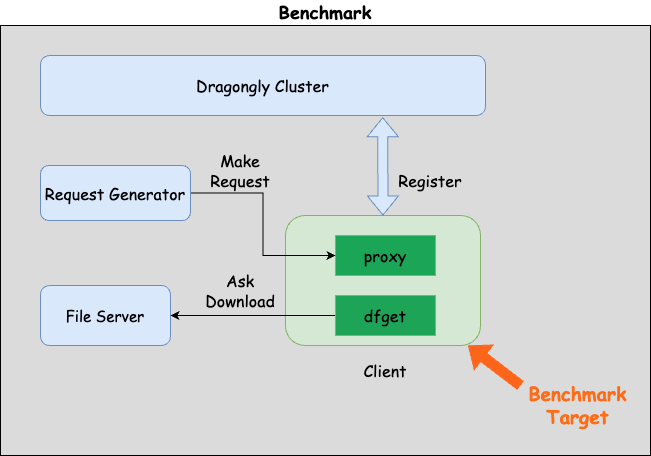

# Performance Optimization Guidance

This is a reference benchmark process document designed to
assist in performance analysis and optimization for **client**.
This document provides as general a testing framework as possible,
allowing developers with needs to adjust it
according to their specific circumstances across various platforms.

## Flow



## Preparation

### Step 1: Setup Dragonfly

- Please refer to [official doc](https://d7y.io/docs/next/getting-started/installation/helm-charts/).

### Step 2: Start a file server

- Start with docker:

```bash
export FILE_SERVER_PORT=12345
docker run -d  --rm -p ${FILE_SERVER_PORT}:80 --name dragonfly-fs dragonflyoss/file-server:latest
```

- Check the file server is ready:

```bash
# return success if ready
curl -s -o /dev/null \
     -w "%{http_code}" \
     http://localhost:12345/nano \
| grep -q "200" \
&& echo "Success" \
|| echo "Failed"
```

- Optional:

> you can build your own image, take a reference from [**Dockerfile**](https://github.com/dragonflyoss/perf-tests/blob/main/tools/file-server/Dockerfile).

### Step 3: Install test tools

- Request Generator: [**oha**](https://github.com/hatoo/oha)

```bash
brew install oha
```

- Profiling: [**flamegraph**](https://github.com/flamegraph-rs/flamegraph)

```bash
cargo install flamegraph
```

### Step 4: Setup Dragonfly Peer

> Document: [Install with binary](https://d7y.io/docs/next/getting-started/installation/binaries/).

- Compile the target binary

```bash
cargo build --release --bin dfdaemon
```

- Connect to Dragonfly

```bash
# prepare client.yaml by yourself.
./target/release/dfdaemon --config client.yaml -l info --console
```

## FlameGraph

Now, let's start benchmark with the following params:

- $FILE_SERVER_ADDRESS
- $CLIENT_PROXY_ADDRESS

### Collect Flamegraph

- Capture the flamegraph:

```bash
## stop after all requests done.
sudo flamegraph -o my_flamegraph.svg --pid 3442
```

- Make the request:

```bash
oha -c 1000 \
    -n 100 \
    --rand-regex-url $FILE_SERVER_ADDRESS/\(nano\|micro\|small\|medium\|large\) \
    -x $CLIENT_PROXY_ADDRESS
```
