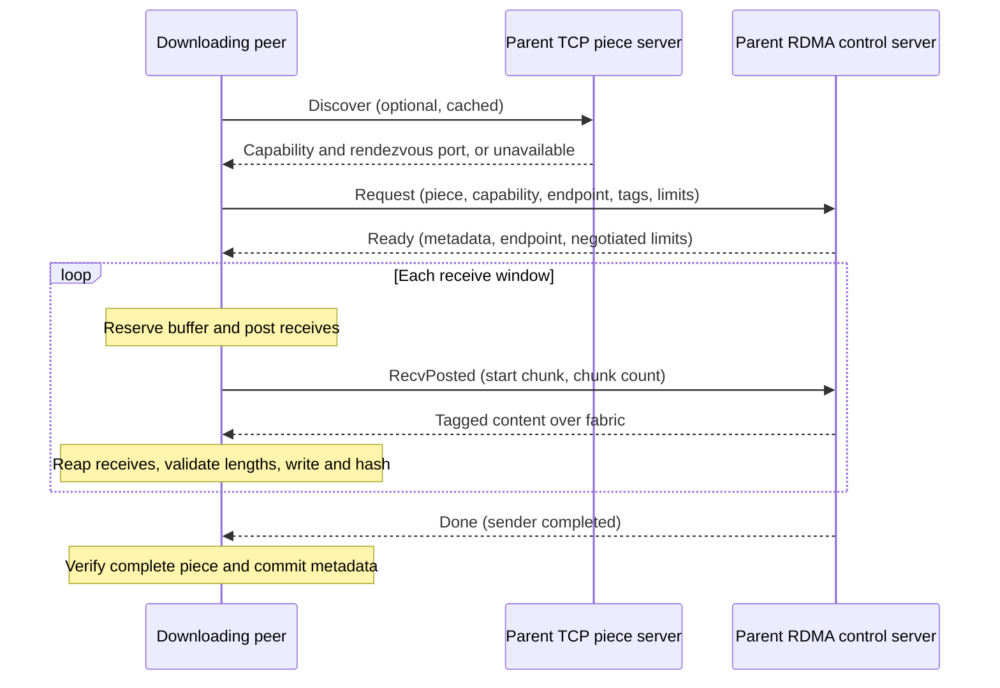

# RFC: Optional RDMA transport for peer-to-peer pieces

Status: **Draft — proposed design, pending maintainer agreement.**

Related issue: [client#1926](https://github.com/dragonflyoss/client/issues/1926).
Prototype: [client#1945](https://github.com/dragonflyoss/client/pull/1945), reviewed at
[`1ccc7d1`](https://github.com/YQ-Wang/dragonfly-client/tree/1ccc7d1048d213dd1237dfe0978a06ac2bde5c1c).

This RFC proposes an optional Linux transport for moving piece content between peers
over AWS EFA or RoCE/InfiniBand. It uses libfabric tagged messaging for content and
TCP for discovery and transfer control. TCP piece download remains the fallback.
The requirements below describe the proposed implementation contract; the prototype
does not yet satisfy all of them. Accepting this RFC would approve the direction,
not establish release readiness or close #1926.

## Motivation and scope

Model, dataset, and image distribution can be limited by network throughput and CPU
overhead on nodes that already have a fast fabric. The goal is to improve completed
piece throughput or CPU cost when the fabric is useful, while preserving Dragonfly's
storage, piece validation, rate limiting, and existing recovery behavior.

The first implementation covers regular, persistent, and persistent-cache pieces,
host memory, and one selected fabric device per endpoint. It is opt-in at build and
runtime. TCP and QUIC remain available without libfabric in the default build.
Scheduler policy, task identity, source downloads, and piece layout do not change.

GPUDirect, multiple-device striping, application-managed one-sided RDMA, automatic
fabric topology discovery, and communication between mutually untrusted tenants
are outside this proposal. A provider is supported only after the validation below;
an EFA result does not establish RoCE or InfiniBand support.

## Decisions requested

Issue #1926 proposes async-rdma and the Vortex protocol. This RFC proposes changes
to that approach and asks maintainers to agree on them before implementation grows.

| Decision | Proposal | Reason and cost |
| --- | --- | --- |
| Initial hardware scope | Include EFA and RoCE/InfiniBand through libfabric. | One application transport interface, with a C dependency and provider-specific testing. If EFA is deferred, reassess async-rdma before committing to this dependency. |
| Transfer interface | Two-sided tagged send/receive on `FI_EP_RDM`. | Application-owned posted buffers and completion-based ownership; no Dragonfly protocol for granting and revoking remote memory access. |
| Control protocol | A small versioned TCP rendezvous protocol, preserving Vortex piece semantics. | Endpoint exchange and receive-window credits are explicit, but this adds a wire contract to maintain. |
| Discovery | Probe the existing TCP piece port; return the actual rendezvous port. | No scheduler/API release dependency, at the cost of a cached probe and an additional TCP listener. |
| Resource bound | One daemon-wide budget for application-owned fabric transfer buffers. | Serving, downloading, and retired endpoints must share accounting. Provider-internal allocations require separate headroom. |

### Why libfabric

[async-rdma](https://github.com/datenlord/async-rdma) is a Rust RDMA interface built
on verbs and is the approach suggested in the issue. Its
[queue-pair implementation supports RC](https://github.com/datenlord/async-rdma/blob/master/src/queue_pair.rs#L174-L179).
An RC queue-pair design is a
reasonable alternative for a RoCE/InfiniBand-only scope. It is not a portable EFA
transport: [EFA uses SRD](https://docs.aws.amazon.com/AWSEC2/latest/UserGuide/efa.html),
and its [libfabric provider](https://ofiwg.github.io/libfabric/v2.1.0/man/fi_efa.7.html)
supports tagged messaging on `FI_EP_RDM`.

The proposal uses `efa` and an appropriate verbs-based RDM provider such as
`verbs;ofi_rxm`. Selection must check returned endpoint capabilities, threading and
progress requirements, registration modes, message limits, and usable tag bits.
`auto` resolves to a concrete provider and device; it is never advertised as a
provider name. Software providers require an explicit development/test setting.

The implementation must document its supported libfabric and vendor-package
versions. Compile-time API availability alone is insufficient to claim support.

### Alternatives

- **async-rdma/RC:** closer to the original issue and avoids owning a libfabric
  wrapper, but needs a separate EFA solution or a smaller hardware scope.
- **Application-managed READ/WRITE:** may suit future workloads, but adds remote
  address/key authorization, lifetime, revocation, and completion rules. EFA does
  support RMA on supported configurations; its absence is not the justification
  for choosing send/receive.
- **Extend Vortex or the upload API:** centralizes protocol ownership and can avoid
  discovery probing. It requires coordinated protocol/API changes. Maintainers may
  prefer this before a second wire contract becomes stable.
- **Keep TCP/QUIC only:** remains the deployment baseline and avoids native fabric
  dependencies. The feature must demonstrate benefit against that baseline.

## Architecture and discovery



RDMA downloading and serving are independently enabled. The downloader uses the
parent's existing advertised TCP address for discovery. It connects to the returned
control port on that same IP, rather than accepting an arbitrary control host from
the response. Fabric addresses are provider-opaque and exchanged during rendezvous.

The server publishes readiness only while both its fabric endpoint and control
listener are healthy. Startup failure, endpoint failure, or shutdown withdraws
readiness. Discovery must remain independent of scheduler changes and must not
interfere with ordinary Vortex requests on the TCP piece port.

A positive discovery result is cached for at most 60 seconds per parent address.
Failures that invalidate the endpoint or capability evict it. Concurrent downloads
to the same parent share an outstanding discovery attempt. Cache size is bounded
and expired entries are removed; TTL alone does not bound memory.

Compatibility requires a supported wire version, identical concrete provider, and
the same non-empty operator-supplied `fabricTag`. This is a conservative eligibility
check, not proof of connectivity or authentication. The tag identifies a reachability
domain; operators must also configure device access, routing, and fabric policy.
For EFA, follow the current [AWS networking and security-group requirements](https://docs.aws.amazon.com/AWSEC2/latest/UserGuide/efa-start.html).

The compatibility matrix must include old peers, feature-disabled peers, serving-only
and downloading-only peers, incompatible providers/tags/versions, and a parent that
restarts with a different endpoint or port. Unrecognized or unavailable discovery
falls back to ordinary TCP on a fresh connection. The implementation must test the
probe against a real older Vortex parser, including fragmented headers, and establish
that the discriminator cannot be mistaken for a supported Vortex request.

## Wire and transfer contract

The prototype framing is:

```text
magic: u32 ("DFRD") | version: u8 | type: u8 | payload length: u32 | payload
```

One rendezvous connection carries one piece attempt and closes after its terminal
outcome. Integers are big-endian. Byte strings have a `u32` length prefix. Proposed limits are
64 KiB per control payload, 512 bytes per endpoint address, and 4 KiB per text field.
Validate lengths before allocation, reject trailing or truncated fields, and reject
unknown versions, types, and illegal state transitions. The prototype uses version
2; an incompatible revision must use a different version. Encoding and state-machine
fixtures must be reviewed before declaring the protocol stable.

| Frame | Required content and meaning |
| --- | --- |
| `Discover` | Empty request on the TCP piece port. |
| `Capability` | Concrete provider, fabric tag, and nonzero rendezvous port. |
| `Request` | Piece kind, task ID, piece number, requester capability, client endpoint, transfer tag base, maximum chunk size, and maximum chunks per window. |
| `Ready` | Parent endpoint, piece offset, length, digest, and negotiated chunk/window limits. |
| `RecvPosted` | First chunk index and count for the next contiguous receive window. |
| `Done` | All sends for this piece have completed on the parent. |
| `Error` | Typed code and bounded diagnostic text. |

The piece kinds preserve the existing `DownloadPiece`, `DownloadPersistentPiece`,
and `DownloadPersistentCachePiece` semantics. This is a separate control encoding,
not wire-compatible Vortex-over-RDMA. It does not redefine task IDs, piece numbering,
offsets, or the existing piece digest format. Keep the existing 1 GiB piece limit.

For piece length `L`, negotiated chunk size `C`, and per-window chunk limit `N`, use
`ceil(L / C)` chunks and windows of at most `C * N` bytes. At most two windows may
be posted per direction, so a transfer has at most `2 * N` posted operations on
either side, further constrained by provider admission. Completed windows awaiting
storage remain charged to the memory budget. Both peers choose the
minimum applicable limits, including provider limits and buffer admission. All
arithmetic is checked. With a 64 KiB minimum chunk, a 1 GiB piece needs 16,384 chunk
identifiers; the tag allocation must accommodate this. If provider constraints
cannot support the required tag space and chunk size, reject the RDMA attempt
before transfer and use TCP. Do not exceed either peer's chunk-size limit. The
prototype's 4,096-tag reservation is not sufficient for every proposed configuration.

Each attempt reserves a disjoint set of usable fabric tags. The allocator must
respect the provider's tag-bit format and prevent overlap or wraparound. An endpoint
generation and its tag ownership remain distinct from any replacement endpoint;
old in-flight traffic must not be accepted as a new transfer. Endpoint information
and tag layout must be validated before posting operations.

The receiver validates the returned offset and length against the expected piece
range before writing. A receive completion must report the expected chunk length.
The parent recomputes each requested window and rejects duplicates, gaps, out-of-range
chunks, and credits exceeding the negotiated limit. It sends only after matching
`RecvPosted`. This is flow control for cooperating peers, not protection against an
unauthorized sender on the fabric.

`Done` is not download success. The receiver needs every expected completion, the
terminal control outcome, exact total length, a valid digest, and a successful storage
metadata commit. Partial pieces remain unavailable to other consumers. Storage
writes stay inside the expected range and preserve the current completion and
notification behavior for all three piece kinds.

Completed buffers may be passed directly to hashing and storage without an
application staging copy. This does not promise NIC-to-disk zero-copy: `pwrite`
and provider internals can still copy bytes. The first implementation may use the
existing stream adapter; direct-window writes and upload mmap are optimizations
that must preserve the same correctness contract.

## Failure, retry, and cancellation

For an active download, an RDMA-specific failure restarts the **whole piece** over
TCP after safe cleanup. Do not continue TCP at an unverified partial offset. If the
TCP retry also fails, use the existing parent/source recovery policy. Caller
cancellation ends the attempt; local storage failure is reported as a storage
failure, rather than repeatedly downloading bytes that cannot be stored.

| Outcome | Immediate action | Subsequent RDMA attempts |
| --- | --- | --- |
| Unsupported peer, version, provider, or fabric tag | Use TCP. | Cache incompatibility for at most 60 seconds. |
| `BUSY` or local buffer/admission pressure | Use TCP after bounded admission. | Retain compatible capability; do not classify capacity as a broken fabric. |
| Peer connection failure, fabric timeout, invalid transfer, or digest mismatch | Clean up and retry the entire piece over TCP. | Invalidate stale discovery and back off that parent from 2 seconds up to 60 seconds. |
| `NOT_FOUND` or `TOO_LARGE` | Use the existing piece retry policy, allowing a TCP attempt. | Do not mark all requests to this parent incompatible. |
| Fatal local endpoint error | Withdraw local readiness and fail affected RDMA attempts. | Reinitialize with the endpoint recovery policy below. |
| Local disk/write failure or caller cancellation | Stop and clean up; report the actual outcome. | Do not penalize the remote parent for a local failure. |

Preserve error codes through the client and storage boundary. Record parent success
only after the complete piece is verified and committed, and report stream failures
to the same health bookkeeping. TCP success must not erase a preceding RDMA penalty.
Backoff/cache state must have bounded storage and must not accumulate indefinitely
as peers churn.

Use one absolute deadline for each RDMA attempt, beginning before discovery. All
network, admission, and receive waits use the remaining time; receiving `Ready` or
starting a background task does not reset it. Individual fabric operations are also
bounded by `transferTimeout`. The TCP fallback gets one normal TCP attempt budget;
there is no repeated RDMA/TCP loop within a piece attempt. This bounds added RDMA
waiting, not kernel filesystem execution time.

Cancellation is cooperative around storage writes. Dropping a future does not stop
an already-running blocking write. On deadline expiry or cancellation, stop admitting
new work, close control traffic, cancel pending fabric operations, and drain existing
storage writes before releasing piece ownership or permitting retry. A retry must
never race an old write to the same range. If cleanup cannot establish safe ownership,
return a cleanup failure rather than start an unsafe retry. The component retaining
an in-progress blocking write must retain exclusive piece ownership until it
completes. Cleanup failure must not make that piece eligible for another attempt
through outer parent/source recovery. Do not advertise a hard
wall-clock completion bound for a stalled filesystem syscall.

The reader must own a cancellation path to its producer; detached receive tasks must
not survive until an unrelated timeout simply because the consumer disappeared.
Cancellation/completion races need bounded cleanup and a single terminal outcome.

### Endpoint recovery and memory lifetime

Both serving and downloading follow the same lifecycle: initialize, publish/use,
withdraw on failure, stop new posts, clean up, then retry initialization. Initial
failure and retirement of a previously healthy endpoint impose at least 300 seconds
before the next initialization attempt, with jitter to avoid fleet-wide retry bursts.
Only one initialization runs per role. TCP remains available during the cooldown.

Every posted operation retains its context, buffer, registration, and accounting
until completion or safe endpoint teardown. A successful `fi_cancel` request alone
does not release ownership. Current [libfabric endpoint documentation](https://ofiwg.github.io/libfabric/main/man/fi_endpoint.3.html#fi_close)
defines endpoint close and buffer lifetime; the implementation must establish the
corresponding guarantee for each supported provider/version and serialize close with
posting and completion processing. The API contract, rather than a provider-name
heuristic about queue-pair destruction, is the basis for reuse.

If close fails or safe teardown cannot be established, retain the affected memory
and its resource charge. A retired generation must not receive a fresh unaccounted
budget. Disable further RDMA initialization if cleanup cannot safely retain resources
within the declared bounds; operator restart may be required. Report this explicitly.

## Resource bounds and configuration

`maxRegisteredBytes` limits application-owned transfer-buffer capacity across the
whole daemon: uploading, downloading, active windows, pooled buffers, and quarantined
buffers from old endpoint generations. Charge capacity, including allocation
granularity, rather than only logical payload length. Separate endpoints may retain
separate registration pools, but share a single budget.

Provider registration caches, internal bounce buffers, completion queues, and other
native resources are additional. Document their limits and required memory headroom;
this setting is not a promise about all pinned memory or process RSS. Bound control
connections, operations, address-vector entries, and peer caches as well. Reclaim
idle entries without removing addresses still referenced by active operations.

A transfer can proceed with one window. A second window is acquired only without
blocking while another is held. Buffer admission is deadline-bounded, and idle
buffers in either role must be reclaimable to prevent one pool from starving the
other. Local resource exhaustion falls back to TCP; it must not create a cycle in
which transfers each hold a buffer while waiting for another.

The following uses the prototype's configuration names as proposed starting points.
The daemon-wide budget and recovery semantics require implementation changes.

```yaml
download:
  protocol: rdma                 # prefer RDMA, allow TCP fallback
storage:
  server:
    rdma:
      enable: true               # independently enable serving
      provider: auto
      fabricTag: training-fabric-a
      port: 4007                 # TCP control, not bulk fabric traffic
      maxRegisteredBytes: 512MiB # application buffers across both roles
```

| Setting | Proposed default | Meaning |
| --- | --- | --- |
| `enable` | `false` | Enable the RDMA control server. |
| `provider` | `auto` | Select `efa` or a compatible verbs-based provider; advertise the resolved name. |
| `device` | unset | Optional local libfabric domain/device selection. |
| `fabricTag` | unset | Non-empty reachability label required when serving or downloading with RDMA. |
| `port` | `4007` | TCP rendezvous listener, discovered through the existing TCP piece port. |
| `maxRegisteredBytes` | `512MiB` | Shared application transfer-buffer budget described above. |
| `chunkSize` | `4MiB` | Maximum chunk size; accepted range 64 KiB–1 GiB, subject to provider and peer limits. |
| `maxInflightChunks` | `16` | Maximum chunks per window; accepted range 1–4,096. |
| `maxConcurrentTransfers` | `64` | Server admission limit; downloader concurrency also follows the existing piece limit. |
| `transferTimeout` | `10s` | Per-operation timeout, within the attempt deadline. |
| `allowSoftwareProvider` | `false` | Permit software providers for development and CI. |
| `mmapContent` | `false` | Optional upload optimization; may be deferred from the first implementation. |

The existing download piece timeout supplies the RDMA attempt budget. Configuration
validation checks cross-field feasibility, including room for one configured window
and a valid tag allocation for every supported piece size. Hardware absence or runtime
initialization failure degrades to TCP with a diagnostic. A binary built without
`rdma` rejects an explicitly enabled RDMA configuration with a clear build-feature
error; it must not silently claim the feature is active.

An RDMA build is Linux-only and needs the chosen libfabric headers and libraries.
Packaging must state runtime dependencies, supported versions, device permissions,
locked-memory limits, and network access for the TCP listeners and selected fabric.
Default releases need not include RDMA until that packaging is validated. Rollback
selects TCP downloading and disables RDMA serving; no stored-content migration is
required.

## Security boundary

The initial deployment boundary is a trusted cluster with access-controlled IP and
fabric networks. `fabricTag`, endpoint addresses, and transfer tags are not credentials.
TCP rendezvous is not authenticated by this proposal. The existing piece checksum
detects accidental corruption; CRC32 does not authenticate content or protect against
a malicious sender. A malicious parent can also supply both content and metadata.

Two-sided messaging means Dragonfly does not implement an application protocol for
exposing remote memory addresses/keys. It does not mean that no key ever crosses the
fabric: providers can implement send/receive using internal RDMA protocols. It also
does not prevent unsolicited messages. Bind receives to the negotiated parent where
the supported provider permits directed receive, and validate source information when
available; this improves isolation without creating cryptographic authentication.
Any remaining wildcard receive behavior must be explicit in the supported-provider
contract. See [libfabric tagged messaging](https://ofiwg.github.io/libfabric/main/man/fi_tagged.3.html).

Protect both listeners and fabric access according to the deployment's trust boundary.
Malformed control input, oversized fields, invalid tags, or a failed peer must not
cause out-of-bounds access, premature buffer reuse, or unbounded native allocations.
Authenticated multi-tenant operation would require a separate security design.

## Validation and rollout

Implementation merge requires evidence for the following behaviors. Software-provider
tests exercise the application and FFI path; they do not establish hardware safety or
performance.

| Area | Required evidence |
| --- | --- |
| Build and packaging | Default builds remain independent of libfabric. Linux CI installs native dependencies and runs RDMA-enabled check, clippy, and tests, including the workspace `--all-features` job. |
| Actual fallback | Drive the piece manager through incompatibility, partial transfer, timeout, peer disappearance, invalid length, and digest mismatch, then complete a real TCP retry for all three piece kinds. Assert bytes, digest, metadata, and one completion notification. |
| Cancellation and ownership | Cancel during admission, rendezvous, posted operations, and storage consumption; race cancellation with completions. Verify no late storage writes after retry, no premature reuse, and bounded task/resource cleanup or accounted quarantine. |
| Recovery and pressure | Concurrent serving/downloading under one budget, one-window progress, slow consumers, repeated endpoint failure, unsuccessful close, and restart/port changes. Verify advertisement withdrawal, cooldown, and absence of resource growth beyond bounds. |
| Wire compatibility | Encoding fixtures, malformed/truncated/oversized inputs, version mismatch, real old peers, fragmented probes, provider/tag mismatch, and preservation of normal TCP requests. Exercise `BUSY` separately from incompatibility and transport failure. |
| Hardware | EFA and each claimed verbs-provider configuration: successful transfer, concurrent load, cancellation, timeout, and teardown. Record device, driver, firmware, OS, libfabric version, and provider options. |

Benchmark complete verified downloads against TCP at equal piece size, concurrency,
CPU placement, and storage/cache conditions. Include small and large pieces, real
disk and memory-backed storage, warm and cold caches, and mixed-capability peers.
Report repeated-run distributions, throughput, CPU time per GiB, tail latency,
memory/resource use, and fallback cost. Transport-only results can help diagnosis,
but must be separated from end-to-end results. Publish commands, configuration,
raw outputs, and the exact commit with each result.

The prototype reports a single-rail EFA experiment on two `p6-b200.48xlarge` nodes,
24 GiB in 512 MiB pieces, best of three runs. Its reported CRC32-plus-write speedup
is 6.2x at concurrency 1 and 2.1x at concurrency 32. These are
[prototype-reported results](https://github.com/YQ-Wang/dragonfly-client/blob/1ccc7d1048d213dd1237dfe0978a06ac2bde5c1c/docs/rdma-p2p.md#measured-behaviour),
not independently reproduced acceptance evidence or a general throughput guarantee.

Roll out first to an explicitly supported provider on a small opt-in cluster. Expose
actual transport, fallback reason, discovery/backoff outcomes, active transfers,
buffer usage/quarantine, endpoint failures, and recovery attempts. Avoid peer IDs or
task IDs as unbounded metric labels. Broader enablement requires demonstrated benefit
and acceptable fallback latency on the target workload; no universal speedup threshold
is assumed by this RFC.

## Prototype gaps and implementation sequence

At `1ccc7d1`, #1945 contains the control protocol, C shim, fabric wrapper, configuration,
three piece kinds, TCP fallback paths, and direct-window writes for regular pieces.
It remains a prototype. In particular:

- Success is recorded when a reader is returned; later failures miss parent backoff.
  Typed capacity/incompatibility outcomes are not preserved throughout the path.
- The downloader can immediately recreate a retired endpoint; the server does not
  retry initialization or withdraw an advertisement when only the fabric fails.
- Upload and download endpoints each receive the full configured buffer budget.
  Shared accounting and recovery across generations need to be implemented.
- Cancellation ownership, deadline composition, usable tag bits, full piece/chunk
  range coverage, and source matching need review against the requirements above.
- The fallback-named mismatch test asserts an RDMA error, not a successful TCP retry.
  Feature-enabled CI also needs libfabric installation.

First agree on hardware scope, control-protocol ownership, discovery, and the resource
contract. Then land reviewable implementation changes covering protocol/configuration,
fabric ownership and cleanup, and integration with all piece kinds and real fallback
tests. Each executable feature must remain disabled until its dependencies and tests
are present. Add direct-window and mmap optimizations only with separate correctness
and performance evidence. Keep #1926 open until the implementation and required
validation are complete.
